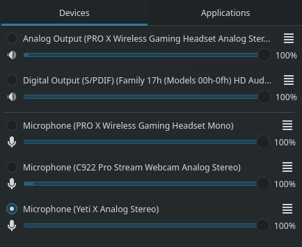
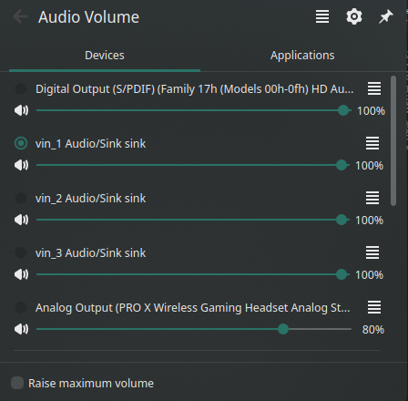
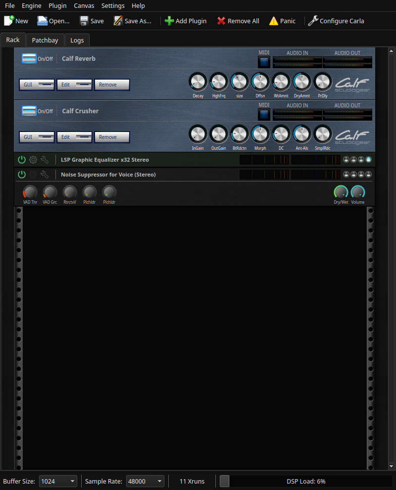
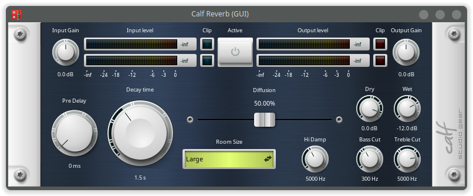
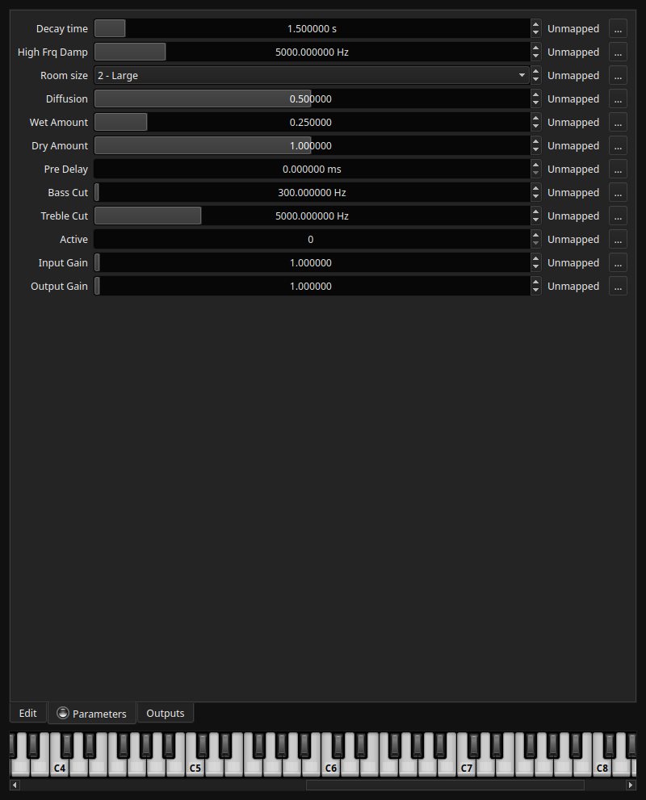
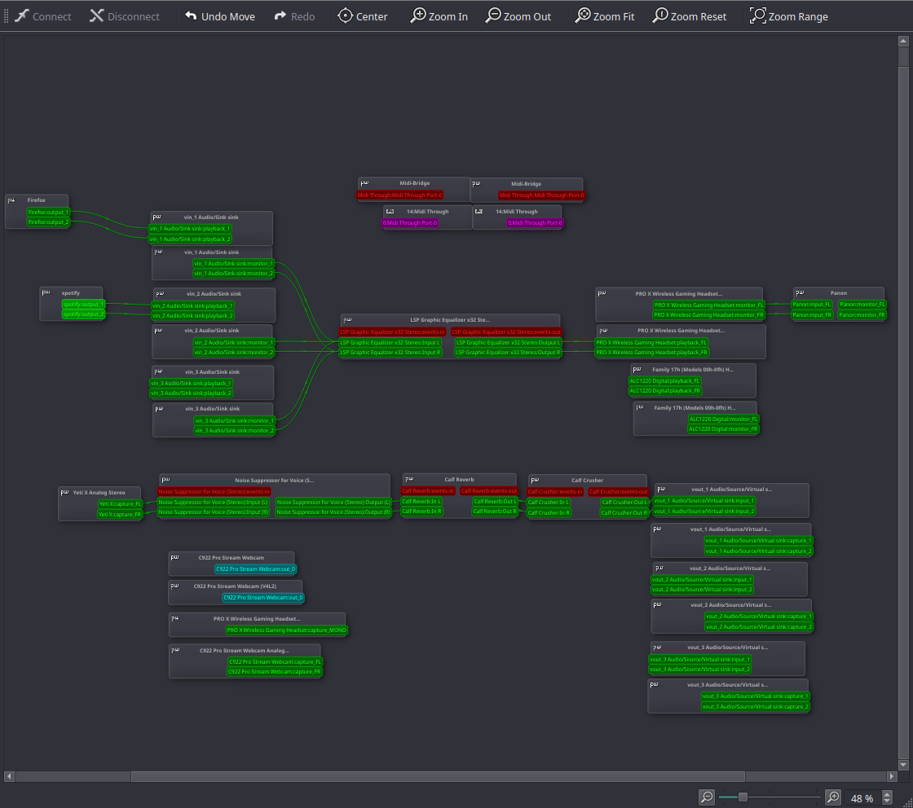

# The Linux Audio Experience

Curveball! I'm journalling my experience of not one, not two, but *three* technologies. They're so well integrated together it would be impossible for me to talk about just one and do it justice. Enjoy!

## Intro

It's expected that an Operating System provides the ability to put audio in, and get audio out of the machine. By that I mean: 

* watching videos
* listening to music
* talking with friends

are all expected interactions with an OS. In order to do this, all Desktop Linux distros have their own combination of tools and utilities at the end users disposal. I'm quite proud of the set up I have, as it's exactly what *I* want, but certainly not something that I'd hand to someone that just wants a machine that works. I'll be talking about 3 services/applications that I use regularly on my workstation.

## PulseAudio

PulseAudio is a sound server software designed primarily to handle the flow of audio through devices connected to the system, through a wide array of configurations. This is the basis for all audio in the OS. PulseAudio uses a system of sinks and sources for providing, and accepting sound. You can think of sinks as audio outputs, and sources as audio inputs. It also provides a plug-in system that can provide virtual sinks and sources between applications and physical devices to modify the sound as the user wishes. All of these options are controlled through either the command line, or an external tool. 

An initial example of an external tool that interfaces with PulseAudio is the Audio widget on the taskbar. This tool shows audio inputs and outputs, as well as which is the default device. You can see here, there's no default output device set, neither of the two outputs are selected. Information is missing, highlighting one of the limitations of both this widget and PulseAudio. It's *really* configurable. To the extent that sometimes external tools don't accurately represent everything that's going on because they fall out of the use case of a generic user. 

Note: Much later I discovered there was a configuration option that enables the visualization of all devices, both physical and virtual (a virtual device was my default output). Below is a screenshot that shows the updated layout, re-themed since it's been so long since I last worked on this entry. It also shows the gear icon that you had to click on to show the setting that I needed to change.

I *seldom* configure PulseAudio on the command line. I felt like it was necessary to address its existence since the other two applications depend heavily on its function.

### UX Goals

* ✅ Effective - Incredibly. When configured properly PulseAudio is a powerful sound engine.
* ❎ Efficient - Not particularly. Without the use of external tools hours of time can be spent in the command line configuring interfaces.
* ❎ Safe - Not at all. There are no undo buttons, and being in the command line is always scary.
* ✅ Satisfying - Yes-ish. It's very satisfying hearing a change in volume, or when a device suddenly picks up audio when sending a command.
* ✅ Learnable - Yes. Given you have time to read an extensive instruction manual.
* ❎ Memorable - No. Constant reference to documentation is almost expected with how convoluted PulseAudio is. I still cannot figure out why the terminology is source/sink, since sinks can output sound, and sources can take in sound...
* ✅ Useful - Incredibly. I like hearing sounds, and without it I simply would not be able to.
* ❎ Error Tolerant - No. If the config file isn't set up properly it will throw a fit and refuse to load.

4/8 UX goals met for a service that's accessed through the command line, and not at all designed to prioritize user experience.

## Carla

Carla is an audio plugin host. This tool on startup provides a UI that looks like a server rack, similar to ones that you'd find in recording studios. Along with that are the classic suite of buttons to create a new rack, open a new rack, save the rack, and configure Carla. Some unfamiliar buttons include the Add Plugin, Remove All, and Panic buttons. 

Shown here are the plugins I have added to the rack. They all have different UI designs due to them being from different developers, not the maintainers of Carla. The top two I have set up to add voice effects when I'm in calls with friends. They both have a GUI button that I prefer to use over the front panel that brings up a lot more options and visually makes more sense to me. I'll be using the reverb plugin to evaluate:

This is the layout of the reverb UI. The 3 buttons/dropdowns/dials I mess with the most are the "active" button in the top center, the decay time knob on the left, and the Room size dropdown on the bottom. When the plugin is not active it has no effect on anything being routed through it. When the decay time is changed, the duration the reverb lasts changes. When the room size dropdown is changed, the "feel" of the reverb changes. It's very clear that the developers of this GUI wanted to make it appear like it was mounted in an audio rack, with the screws in the corners of the window. These two plugins are my favorite aesthetically, but they sacrifice some features of the other plugins that I wish they had, like the ability to type in numbers. Carla itself provides a workaround for this. By right clicking on the plugin in the rack, and selecting the "Edit" option it brings up text boxes where you can type in the parameters. The drawback is this looks nowhere near as clean as the GUI provided by the plugin itself. See below.

### UX Goals

* ✅ Effective - Carla is a very useful tool and I've yet to find any free and open source equivalent anywhere else.
* ✅ Efficient - I'm giving it a check because I'm able to use it and kinda understand what I'm doing, but the parameters page is VERY confusing.
* ❎ Safe - It has a panic button. I'm not sure what that does, and I've never had to press it. But the fact that it has it at all speaks for itself.
* ✅ Satisfying - Yes, seeing audio flow through the plugins and hearing the modifications is quite satisfying.
* ✅ Learnable - Yes, there's plenty of documentation for carla itself, the plugins itself however can be very annoying.
* ✅ Memorable - I seldom have to interact much with it, but every time I come back to it I can pretty easily pick up where I left off.
* ✅ Useful - I don't think there's anything else quite like it for audio modification.
* ❎ Error Tolerant - Again, the fact that it has a panic button makes me think that it might not be the most error tolerant.

6/8 UX goals met, only losing out on 2 due to lacking proper error handling, leaving it up to the user to press a panic button.

## qpwgraph

This is the tool that I wanted to talk about. It is the single coolest audio tool I've ever used, and will probably be the reason I never go back to Windows.

It's a graph! It's the most computer sciency answer to the problem of figuring out where audio sources and applications are connecting. I have 3 virtual outputs (sinks) and 3 virtual inputs (sources). Important details: 

* The 3 outputs all get routed to an equalizer plugin in Carla that bass boosts them all, and then to my headset. 
* My microphone gets routed into 3 plugins from Carla, and then out to a virtual mic. I have 3 virtual outputs so that when I'm streaming I can play music without the streaming software picking up the music. (streaming software would only listen from vin_1)

All applications put sound into one of the virtual sinks (hence why they're named vin_x), and listen from the virtual sources (hence vout_x). But that's just the configuration I have made for myself. With this application you could visualize any sort of chaining or configuration. One of the drawbacks, however is that the application doesn't actually provide a way to create virtual sources and sinks. I created them through the command line, but there are tools that have a UI out there that can create them for you. 

### UX Goals

* ✅ Effective - Yes. Besides lacking a couple minor features the application is very clean and complete.
* ✅ Efficient - Yes. It's as simple as dragging between two nodes to connect their audio.
* ✅ Safe - Yes. Any mistake can quickly be undone or redone with the buttons in the top menu bar.
* ✅ Satisfying - Yes. It has a very clean and concise layout and allows for great organization of the audio system.
* ✅ Learnable - Yes. It's very clear how devices can be arranged and configured.
* ✅ Memorable - Yes. Similar to its learnability, the way devices are connected is hard to forget.
* ✅ Useful - Incredibly. Any time I have an audio issue I can fall back to this application to see exactly what's going on.
* ✅ Error Tolerant - Yes. It's near impossible to create an invalid configuration, and any bad configuration that's not invalid can be undone.

8/8 UX goals met. It's a very resilient application, and that's saying a lot given it's designed for the linux desktop environment.